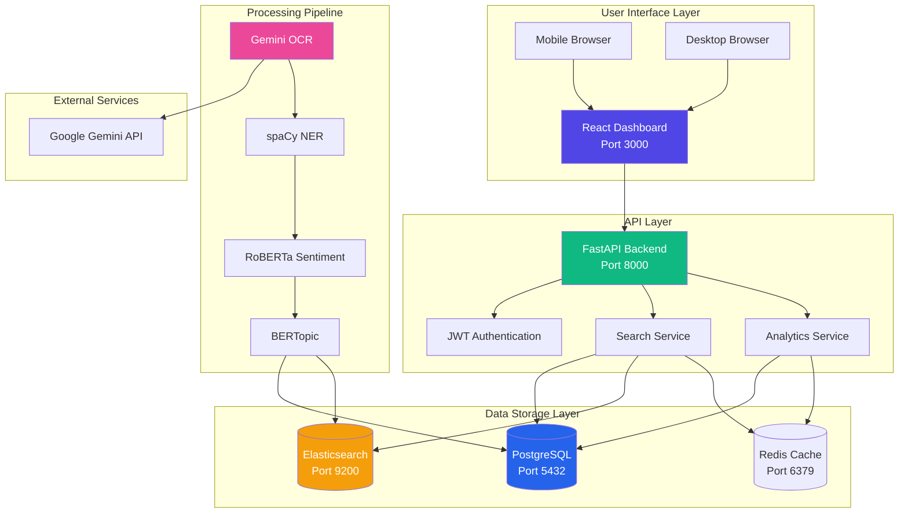
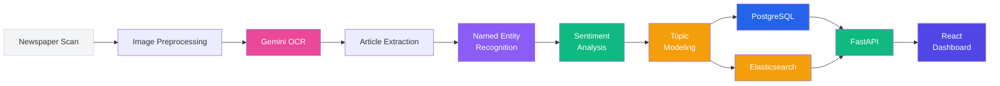
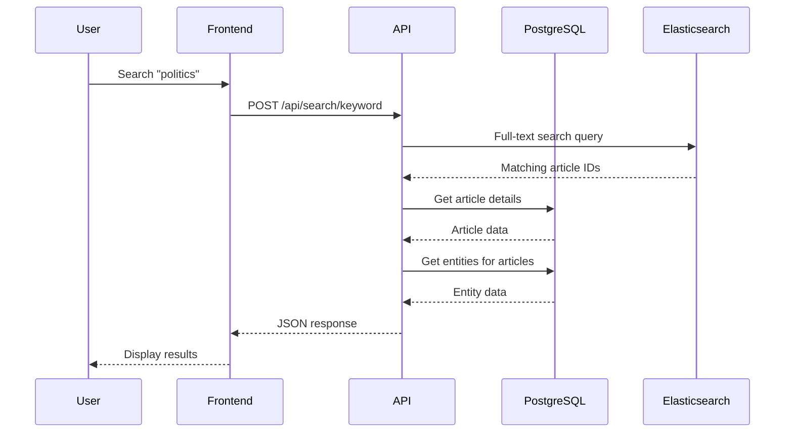
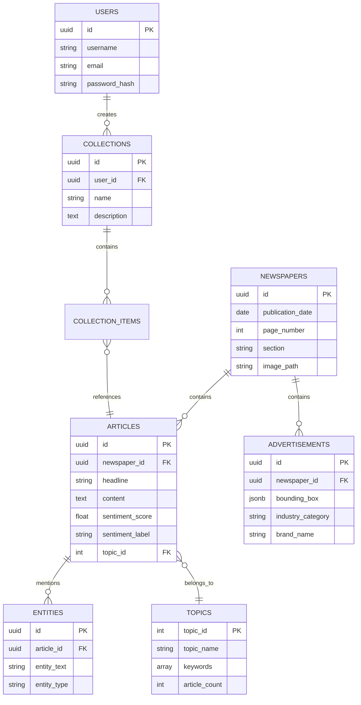
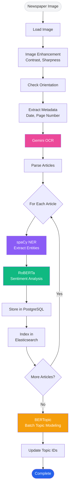
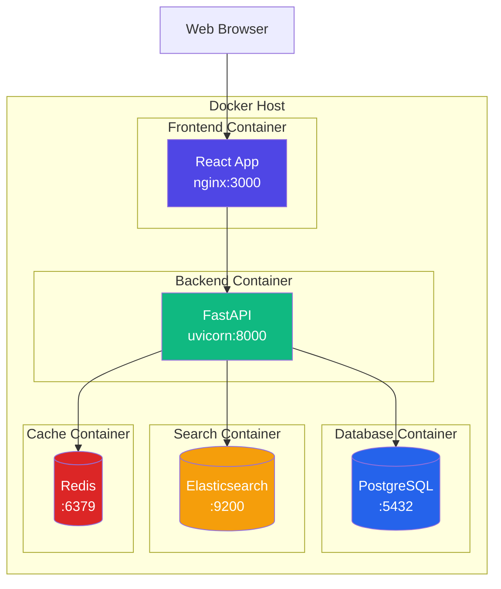
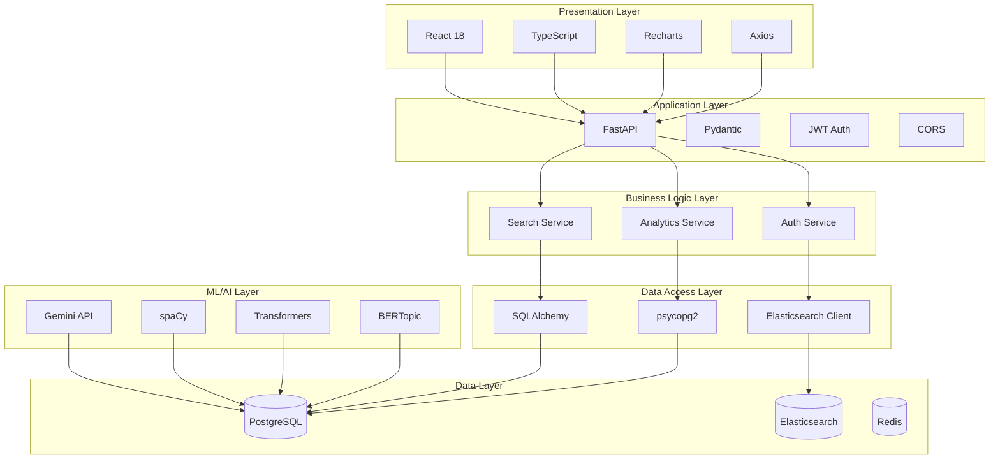

# MediaScope System Architecture Diagram

## High-Level Architecture



## Data Flow



## Component Interaction



## Database Schema Overview



## Processing Pipeline Detail



## API Endpoint Structure

```mermaid
mindmap
  root((MediaScope API))
    Authentication
      POST /auth/register
      POST /auth/login
    Search
      POST /search/keyword
      POST /search/entity
      GET /search/topics
    Analytics
      POST /analytics/keyword-trend
      GET /analytics/entity-trend
      POST /analytics/topic-distribution
      GET /analytics/sentiment-overview
      GET /analytics/top-entities
    Articles
      GET /articles/{id}
      GET /articles
    Health
      GET /health
      GET /
```

## Deployment Architecture



## Technology Stack Layers



---

## How to Use These Diagrams

### In Documentation
Copy the Mermaid code blocks into:
- README.md
- Technical specifications
- Presentation slides (many tools support Mermaid)
- GitHub (renders Mermaid natively)

### Tools that Support Mermaid
- GitHub/GitLab markdown
- VS Code (with Mermaid extension)
- Notion
- Obsidian
- Confluence (with plugin)
- Draw.io (can import)

### Export Options
Use https://mermaid.live to:
- View and edit diagrams
- Export as PNG/SVG
- Share with team

---

These diagrams provide a complete visual understanding of:
✅ System architecture
✅ Data flow
✅ Component interaction
✅ Database relationships
✅ Processing pipeline
✅ API structure
✅ Deployment setup
✅ Technology layers
